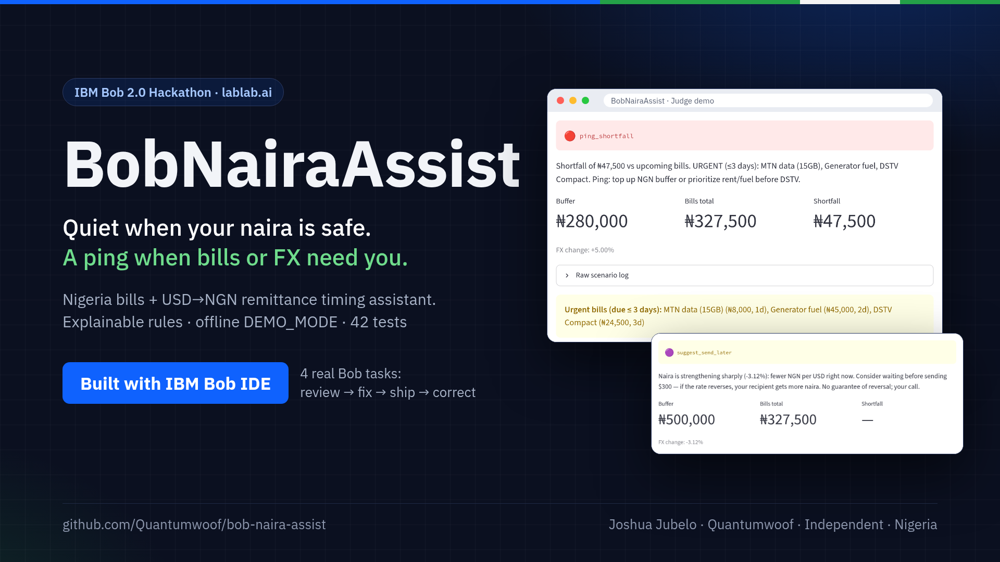
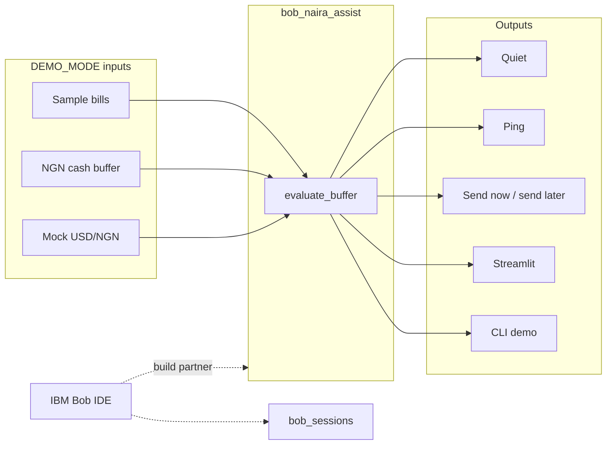

# BobNairaAssist

**Nigeria remittance + everyday money assistant** — built to showcase **IBM Bob IDE** as the core development partner (*turn idea into impact faster*).

IBM Bob 2.0 LabLab hackathon · team **BobNairaAssist** · builder **Joshua Jubelo** (Quantumwoof) · Independent · Nigeria (Lokoja / Abuja)

**▶ Live demo (runs in your browser, DEMO_MODE):** https://quantumwoof.github.io/bob-naira-assist/ (first load takes 10–30 s while Pyodide downloads)



[Team page](https://lablab.ai/ai-hackathons/ibm-bob-2-hackathon/bobnairaassist) · Contact: caughtsight007@gmail.com · Org: [Quantumwoof](https://github.com/Quantumwoof)

## What works today vs pending

| Status | Item |
|--------|------|
| **Works offline now** | `DEMO_MODE` CLI, Streamlit UI, pytest (42 tests) — 5 active decision outcomes, bill-horizon filter, urgent-bill naming |
| **Decision outcomes** | `quiet` · `ping_shortfall` (names urgent bills ≤3 days) · `ping_fx_watch` · `suggest_send_now` · `suggest_send_later` (naira strengthening ≥3%) · `suggest_wait` (deprecated; kept for Streamlit style map only) |
| **Bill-horizon / urgent bills** | `total_due` accepts `horizon_days`; shortfall message names bills due ≤3 days; Streamlit shows them in a warning box |
| **CI workflow** | `.github/workflows/ci.yml` ready locally (pytest on 3.11/3.12); push blocked until `gh` token has `workflow` scope |
| **Bob IDE sessions** | `bob_sessions/` holds real exported session reports (task-01 architecture review, task-02 decision fixes, task-03 UI & docs, task-04 FX sender-view fix) |
| **Live demo** | [`index.html`](index.html) serves the same `app.py` on GitHub Pages via [stlite](https://github.com/whitphx/stlite) (Pyodide), with no server and no keys |
| **Not required for demo** | watsonx / cloud LLM / live bank or FX APIs |

## Problem / who for / why an agent

**Who:** Nigerian households and diaspora helpers who pay rent, DSTV, MTN data, and generator fuel while timing USD→NGN remittances.

**Pain:** Constant rate and bill noise. People either over-check FX or miss a shortfall until DSTV or fuel is due.

**Why an agent:** Stay **quiet** when the NGN buffer covers bills and FX is calm; **ping** on shortfall or adverse FX; suggest **send now vs send later** for a planned remittance, from the sender's point of view. Small, explainable tools — not a black-box chatbot.

## Judge demo beats (honest)

CLI / Streamlit **Judge demo** runs three deterministic beats, plus two optional extras (the fifth active outcome, `ping_fx_watch`, is reachable in the Playground with the `watch` FX scenario):

1. **Quiet** — buffer covers bills, stable FX, **no** remittance planned → `quiet`
2. **Shortfall ping** — buffer below bills → `ping_shortfall`; urgent bills due ≤3 days are named in the message and surfaced in the Streamlit warning box
3. **FX spike → send now** — buffer OK, FX spike ≥3% (naira *weaker*, meaning each USD buys *more* NGN), remittance planned → `suggest_send_now`
   The rate moved in the sender's favour; the agent advises sending now or splitting before it reverts.
4. **Optional · Send now (stable FX)** (Playground / `run_send_now_scenario`): buffer OK + stable FX + remittance → `suggest_send_now`
5. **Optional · Send later** (Playground / `run_send_later_scenario`): naira strengthening ≥3% (USD/NGN falling, fewer NGN per USD), remittance planned → `suggest_send_later`

All outcomes are implemented in [`decisions.py`](bob_naira_assist/decisions.py), tested in [`tests/test_fixes.py`](tests/test_fixes.py), and wired into Streamlit [`app.py`](app.py).

## Architecture



More detail: [`docs/architecture.md`](docs/architecture.md) · checklist: [`docs/submission-checklist.md`](docs/submission-checklist.md).

## Quick start (`DEMO_MODE`)

No IBM / watsonx / cloud LLM credentials required.

```bash
git clone https://github.com/Quantumwoof/bob-naira-assist.git
cd bob-naira-assist
python -m venv .venv && source .venv/bin/activate
pip install -r requirements.txt
# optional editable install for console script:
# pip install -e ".[dev]"
export DEMO_MODE=1   # default if unset

pytest -q
python -m bob_naira_assist
# or: bob-naira-assist   (after pip install -e .)
streamlit run app.py
```

Optional env template (empty keys only): [`.env.example`](.env.example).

## How IBM Bob was used

Hackathon judging expects **IBM Bob IDE as a core component**. This repo is structured for that:

| Artifact | Purpose |
|----------|---------|
| [`AGENTS.md`](AGENTS.md) | How to run intentional multi-step Bob tasks on this codebase |
| [`docs/bob-workflow.md`](docs/bob-workflow.md) | The Bob workflow as it actually ran (4 tasks) + next candidate tasks |
| [`bob_sessions/`](bob_sessions/) | Exported Bob IDE task reports + consumption screenshots (4 sessions) |

**Access:** Hackathon Enterprise instance (40 Bobcoin budget). The four sessions used about 5.3 Bobcoins in total (0.216 + 1.01 + 1.89 + 2.20, per the consumption screenshots). Build window **Sep 25–27 2026**.

### Honest status

Four real Bob IDE session exports are in `bob_sessions/`: task-01 (architecture review), task-02 (decision-logic fixes), task-03 (UI wiring + docs), task-04 (FX sender-view fix: a sharp naira weakening now suggests sending, not waiting). Each includes a markdown report and a screenshot.

watsonx is optional later and is **not** required for the offline demo.

## Related prior work (cite only)

Earlier Quantumwoof experiments in the remittance / Naira space (separate repos; not copied here): `naira-pulse`, `edge-remit`, `voice-remit-ng`, `naira-remit`.


## Known limitations

| Blocker | Impact | Notes |
|---------|--------|-------|
| GitHub `workflow` OAuth scope | Cannot push `.github/workflows/ci.yml` to `main` yet | File ready locally; CI note in checklist |
| No watsonx / live FX | Offline DEMO only | Intentional for judge path |

## License

MIT © 2026 Joshua Jubelo (Quantumwoof)
