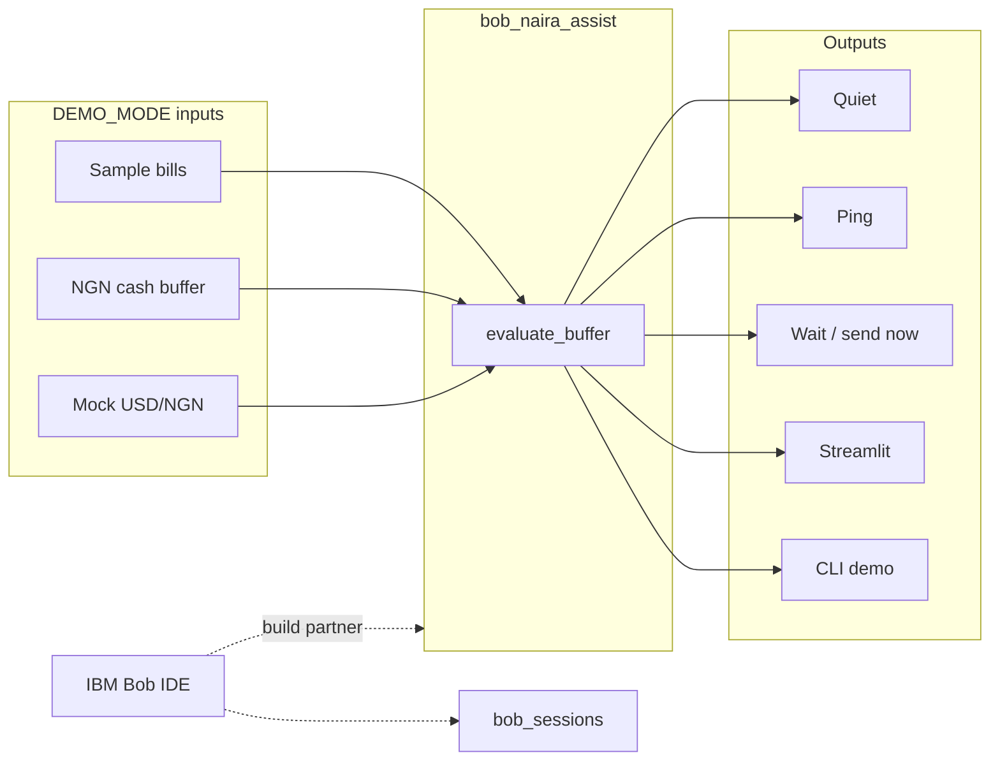

# BobNairaAssist

**Nigeria remittance + everyday money assistant** — built to showcase **IBM Bob IDE** as the core development partner (*turn idea into impact faster*).

IBM Bob 2.0 LabLab hackathon · team **BobNairaAssist** · builder **Joshua Jubelo** (Quantumwoof) · Independent · Nigeria (Lokoja / Abuja)

[Team page](https://lablab.ai/ai-hackathons/ibm-bob-2-hackathon/bobnairaassist) · Contact: caughtsight007@gmail.com · Org: [Quantumwoof](https://github.com/Quantumwoof)

## Problem / who for / why an agent

**Who:** Nigerian households and diaspora helpers who pay rent, DSTV, MTN data, and generator fuel while timing USD→NGN remittances.

**Pain:** Constant rate and bill noise. People either over-check FX or miss a shortfall until DSTV or fuel is due.

**Why an agent:** Stay **quiet** when the NGN buffer covers bills and FX is calm; **ping** on shortfall or adverse FX; suggest **wait vs send now** for a planned remittance. Small, explainable tools — not a black-box chatbot.

## Architecture



More detail: [`docs/architecture.md`](docs/architecture.md).

## Quick start (`DEMO_MODE`)

No IBM / watsonx / cloud LLM credentials required.

```bash
git clone https://github.com/Quantumwoof/bob-naira-assist.git
cd bob-naira-assist
python -m venv .venv && source .venv/bin/activate
pip install -r requirements.txt
export DEMO_MODE=1   # default if unset

pytest -q
python -m bob_naira_assist
streamlit run app.py
```

Optional env template (empty keys only): [`.env.example`](.env.example).

## How IBM Bob is / will be used

Hackathon judging expects **IBM Bob IDE as a core component**. This repo is structured for that:

| Artifact | Purpose |
|----------|---------|
| [`AGENTS.md`](AGENTS.md) | How to run intentional multi-step Bob tasks on this codebase |
| [`docs/bob-workflow.md`](docs/bob-workflow.md) | Planned sessions: scaffold, tests, docs, remittance-logic review |
| [`bob_sessions/`](bob_sessions/) | **Required before final submit:** exported Bob task reports + screenshots |

**Access:** Personal trial may be used now; hackathon Enterprise invite (~40 Bobcoins) may arrive at kickoff. Build window **Sep 25–27 2026**; submit by **Sep 27 15:00 UTC**.

### Honest status

**Bob session reports are pending** until Bob IDE access is available. `bob_sessions/` currently holds placeholders only — we do not claim completed session exports yet.

watsonx is optional later and is **not** required for the offline demo.

## Related prior work (cite only)

Earlier Quantumwoof experiments in the remittance / Naira space (separate repos; not copied here): `naira-pulse`, `edge-remit`, `voice-remit-ng`, `naira-remit`.

## License

MIT © 2026 Joshua Jubelo (Quantumwoof)
