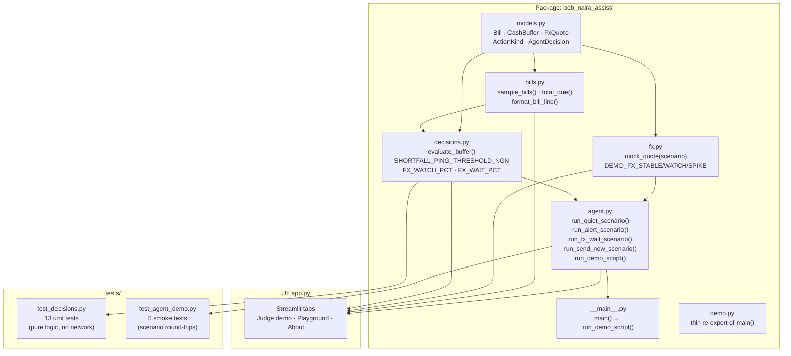
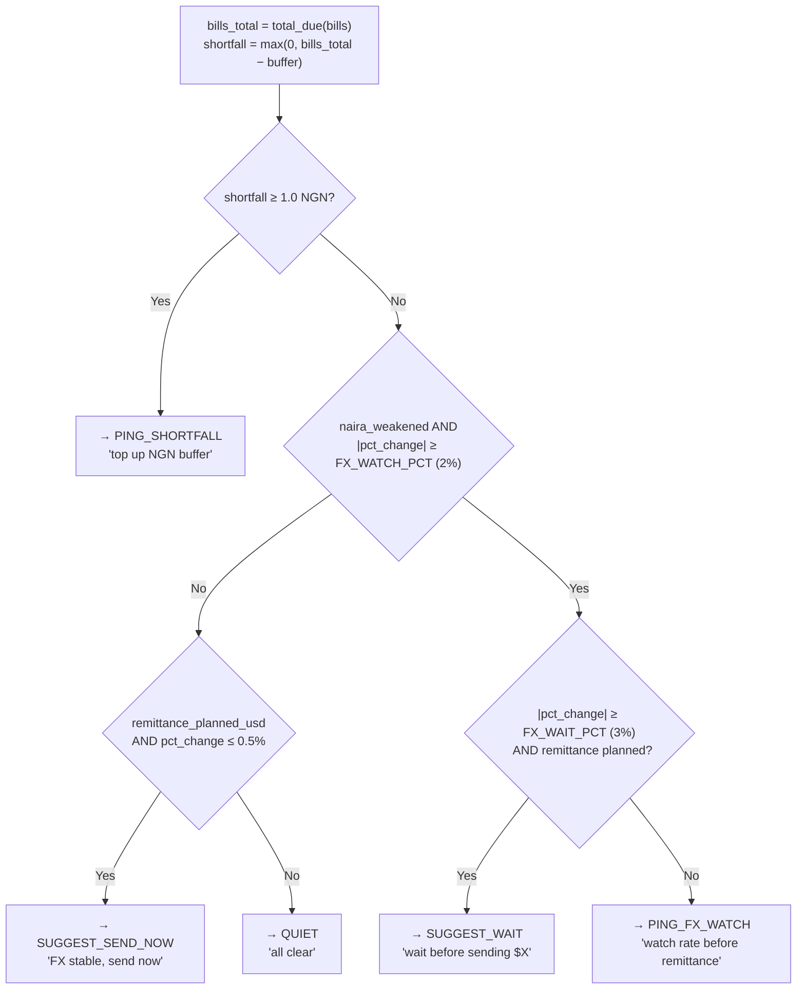

# Explain the architecture of this repo (bob_naira_assist package, app.py Streamlit UI, tests). Walk through how evaluate_buffer decides between quiet, ping_shortfall, suggest_wait and suggest_send_now. Then list the top 3 concrete gaps or edge-case risks you see in the decision logic, citing file and function names. Do not modify any files.

---

**Status:** active  **Date:** 2026-09-26

---

### 👤 User

Explain the architecture of this repo (bob_naira_assist package, app.py Streamlit UI, tests). Walk through how evaluate_buffer decides between quiet, ping_shortfall, suggest_wait and suggest_send_now. Then list the top 3 concrete gaps or edge-case risks you see in the decision logic, citing file and function names. Do not modify any files.

---

### 🤖 Assistant

> 🔧 called: list_files

Let me investigate the codebase thoroughly before answering.

> 🔧 **list_files** — .

### 🤖 Assistant

> 🔧 called: list_files, list_files


> 🔧 **list_files** — bob_naira_assist

> 🔧 **list_files** — tests

### 🤖 Assistant

> 🔧 called: read_file, read_file


> 🔧 **read_file** — bob_naira_assist/models.py

> 🔧 **read_file** — bob_naira_assist/decisions.py

### 🤖 Assistant

> 🔧 called: read_file, read_file, read_file


> 🔧 **read_file** — bob_naira_assist/fx.py

> 🔧 **read_file** — bob_naira_assist/bills.py

> 🔧 **read_file** — bob_naira_assist/agent.py

### 🤖 Assistant

> 🔧 called: read_file, read_file, read_file


> 🔧 **read_file** — app.py

> 🔧 **read_file** — bob_naira_assist/__main__.py

> 🔧 **read_file** — bob_naira_assist/demo.py

### 🤖 Assistant

> 🔧 called: read_file, read_file


> 🔧 **read_file** — tests/test_decisions.py

> 🔧 **read_file** — tests/test_agent_demo.py

### 🤖 Assistant

Now I have everything I need. Here's the full architecture walkthrough and gap analysis.

---

## Architecture Overview



### Layer-by-layer summary

| Layer | Files | Responsibility |
|---|---|---|
| **Domain models** | [`models.py`](bob_naira_assist/models.py) | Pure frozen dataclasses + enums. No logic. |
| **Bills** | [`bills.py`](bob_naira_assist/bills.py) | Hardcoded demo bills; [`total_due()`](bob_naira_assist/bills.py:20) sums `amount_ngn` across all bills regardless of due date. |
| **FX** | [`fx.py`](bob_naira_assist/fx.py) | Three deterministic `FxQuote` fixtures; [`mock_quote()`](bob_naira_assist/fx.py:15) dispatches by string key. |
| **Decision engine** | [`decisions.py`](bob_naira_assist/decisions.py) | [`evaluate_buffer()`](bob_naira_assist/decisions.py:22) — the sole logic function. |
| **Scenarios / agent** | [`agent.py`](bob_naira_assist/agent.py) | Wires bills + FX + buffer into four named scenarios; [`run_demo_script()`](bob_naira_assist/agent.py:69) strings the judge's three-beat story. |
| **CLI entry** | [`__main__.py`](bob_naira_assist/__main__.py) | `python -m bob_naira_assist` → `run_demo_script()`. |
| **Streamlit UI** | [`app.py`](app.py) | Three tabs: deterministic judge buttons, interactive Playground slider, About page. |
| **Tests** | [`test_decisions.py`](tests/test_decisions.py), [`test_agent_demo.py`](tests/test_agent_demo.py) | Pure unit + smoke tests; no network, no credentials. |

---

## How `evaluate_buffer()` decides

The function lives entirely in [`decisions.py:22-106`](bob_naira_assist/decisions.py:22). It runs a **priority waterfall** — the first matching branch wins and returns immediately:



**Key numeric thresholds** (all in [`decisions.py:17-19`](bob_naira_assist/decisions.py:17)):

| Constant | Value | Meaning |
|---|---|---|
| `SHORTFALL_PING_THRESHOLD_NGN` | `1.0` | Any shortfall ≥ ₦1 triggers a ping |
| `FX_WATCH_PCT` | `2.0%` | Adverse FX move worth a watch ping |
| `FX_WAIT_PCT` | `3.0%` | Adverse FX move large enough to suggest waiting on remittance |

The `suggest_send_now` stable-band check uses the literal `0.5` inline at [`decisions.py:85`](bob_naira_assist/decisions.py:85) — this threshold is **not exported as a named constant**, unlike the other three.

---

## Top 3 Concrete Gaps / Edge-Case Risks

### Gap 1 — `suggest_send_now` fires on *naira-strengthening* spikes (silent false positive)

**File/function:** [`decisions.py:85`](bob_naira_assist/decisions.py:85) in `evaluate_buffer()`

```python
if remittance_planned_usd and fx.pct_change <= 0.5:
```

The condition checks only `pct_change <= 0.5`, which is `True` for **any negative value** — i.e., when the naira has strengthened dramatically (e.g., `pct_change = -10%`). A sender remitting during a sharp naira-strengthening event would get `SUGGEST_SEND_NOW` even though a large rally might reverse, making "wait and see" equally valid advice. The guard `fx.naira_weakened` is checked in the FX-watch branch but not here. The `test_naira_strengthening_stays_quiet_without_remittance` test in [`test_decisions.py:122`](tests/test_decisions.py:122) only covers the no-remittance case; `pct_change = -10%` **with** `remittance_planned_usd=200` is not tested and produces `suggest_send_now` without comment.

---

### Gap 2 — `total_due()` is time-blind: all bills are treated as due *right now*

**File/function:** [`bills.py:20`](bob_naira_assist/bills.py:20) `total_due()` and [`models.py:25`](bob_naira_assist/models.py:25) `Bill.due_in_days`

```python
def total_due(bills: List[Bill]) -> float:
    return sum(b.amount_ngn for b in bills)  # ignores due_in_days entirely
```

`Bill` carries a `due_in_days` field, but `total_due` unconditionally sums every bill. The ₦327,500 total includes rent due in 5 days and MTN data due tomorrow — all weighted equally. This means:
- A buffer of ₦9,000 (enough for MTN data today + fuel tomorrow) still triggers `PING_SHORTFALL` because rent due in 5 days inflates the total.
- Conversely, a buffer that covers the imminent bills but not rent will look like a shortfall even if the user plans to top up before rent is due.

The field exists but is never read anywhere in the codebase.

---

### Gap 3 — The FX `SUGGEST_WAIT` branch is silently bypassed when `remittance_planned_usd=0`

**File/function:** [`decisions.py:63`](bob_naira_assist/decisions.py:63) in `evaluate_buffer()`

```python
if abs(fx.pct_change) >= FX_WAIT_PCT and remittance_planned_usd:
```

Python's truthiness check treats `remittance_planned_usd=0` as falsy, so passing `0.0` (an explicit "I plan to send nothing") falls through to `PING_FX_WATCH`, which is probably the intended behaviour. **But** the Streamlit Playground's number_input at [`app.py:137`](app.py:137) defaults to `0` and passes `float(remit_usd) if remit_usd else None`:

```python
remittance_planned_usd=float(remit_usd) if remit_usd else None,
```

That coercion is consistent, so the UI is safe. The silent risk is that any *future* caller that passes `remittance_planned_usd=0.0` explicitly (e.g., a unit test building a "zero-dollar remittance" case) will get `PING_FX_WATCH` instead of `SUGGEST_WAIT`, with no error or warning — and the function signature `Optional[float] = None` doesn't signal that zero is treated the same as absent. There is also no test that exercises `remittance_planned_usd=0.0` explicitly to document this contract.