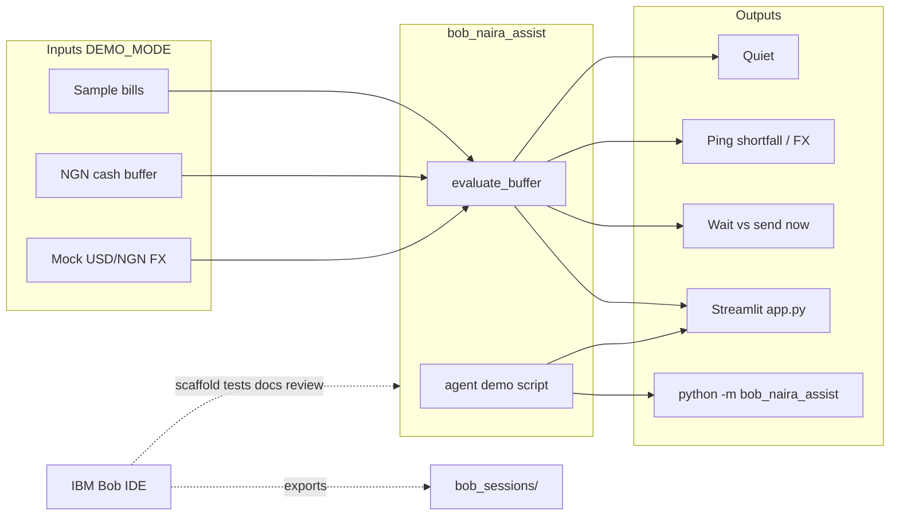

# Architecture

BobNairaAssist keeps the agent story small and testable: pure Python decisions + Streamlit UI,
with IBM Bob IDE as the planned build partner (session exports in `bob_sessions/`).

## Mermaid overview

## Modules

| Module | Role |
|--------|------|
| `models.py` | Bills, buffer, FX quote, `AgentDecision` |
| `bills.py` | Deterministic sample Nigerian bills |
| `fx.py` | Mock stable / spike USD/NGN quotes |
| `decisions.py` | Pure quiet-vs-ping + remittance timing |
| `agent.py` | DEMO_MODE scripted scenarios |
| `app.py` | Streamlit judge path |

## Non-goals (MVP)

- Live bank APIs, live FX feeds, or paid SMS.
- Required watsonx / cloud LLM for the offline demo.
- Claiming Bob session reports before they are exported.
