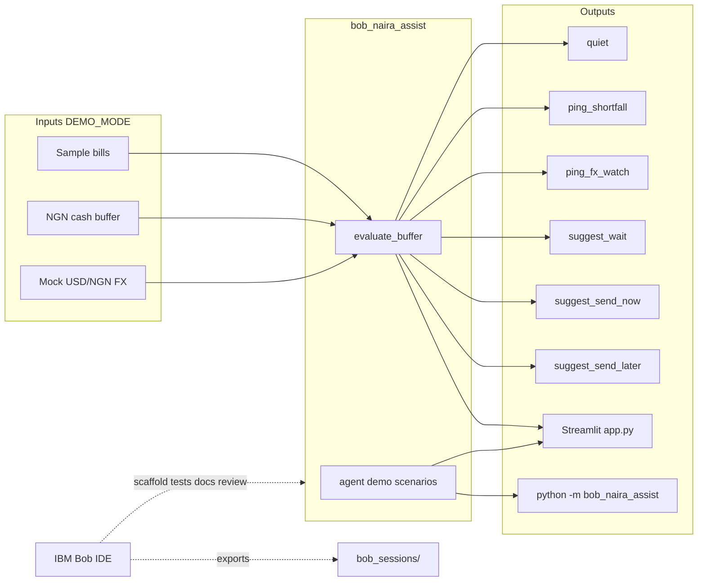

# Architecture

BobNairaAssist keeps the agent story small and testable: pure Python decisions + Streamlit UI,
with IBM Bob IDE as the planned build partner (session exports in `bob_sessions/`).

## Mermaid overview

## Decision priority (`decisions.py`)

1. Cash shortfall vs bills (within 30-day horizon) → `ping_shortfall`
   Bills due within 3 days are named as **urgent** in the ping message.
2. Adverse FX ≥ 3% + remittance planned → `suggest_wait`; else adverse FX ≥ 2% → `ping_fx_watch`
3. Naira **strengthening** sharply (USD/NGN falling ≥ 3%) + remittance planned → `suggest_send_later`
   Sending now yields fewer naira per dollar; advisory wait in case of reversal.
4. Remittance planned + FX stable (pct ≤ 0.5) → `suggest_send_now`
5. Else → `quiet`

### Edge-case rules
- `remittance_planned_usd=0.0` is treated identically to `None` — no remittance actions fire.
- `total_due(bills, horizon_days=N)` excludes bills whose `due_in_days > N` (default 30).

## Demo scenarios (`agent.py`)

| Beat | Function | Expected action |
|------|----------|-----------------|
| Judge 1 | `run_quiet_scenario` | `quiet` (no remittance — never remittance-as-quiet) |
| Judge 2 | `run_alert_scenario` | `ping_shortfall` |
| Judge 3 | `run_fx_wait_scenario` | `suggest_wait` |
| Optional | `run_send_now_scenario` | `suggest_send_now` |

## Modules

| Module | Role |
|--------|------|
| `models.py` | Bills, buffer, FX quote, `AgentDecision` |
| `bills.py` | Deterministic sample Nigerian bills (total ₦327,500) |
| `fx.py` | Mock `stable` / `watch` (~2.5%) / `spike` (5%) quotes |
| `decisions.py` | Pure quiet-vs-ping + remittance timing |
| `agent.py` | DEMO_MODE scripted scenarios |
| `demo.py` | Thin `python -m bob_naira_assist.demo` alias |
| `app.py` | Streamlit judge path |

## Non-goals (MVP)

- Live bank APIs, live FX feeds, or paid SMS.
- Required watsonx / cloud LLM for the offline demo.
- Claiming Bob session reports before they are exported.
